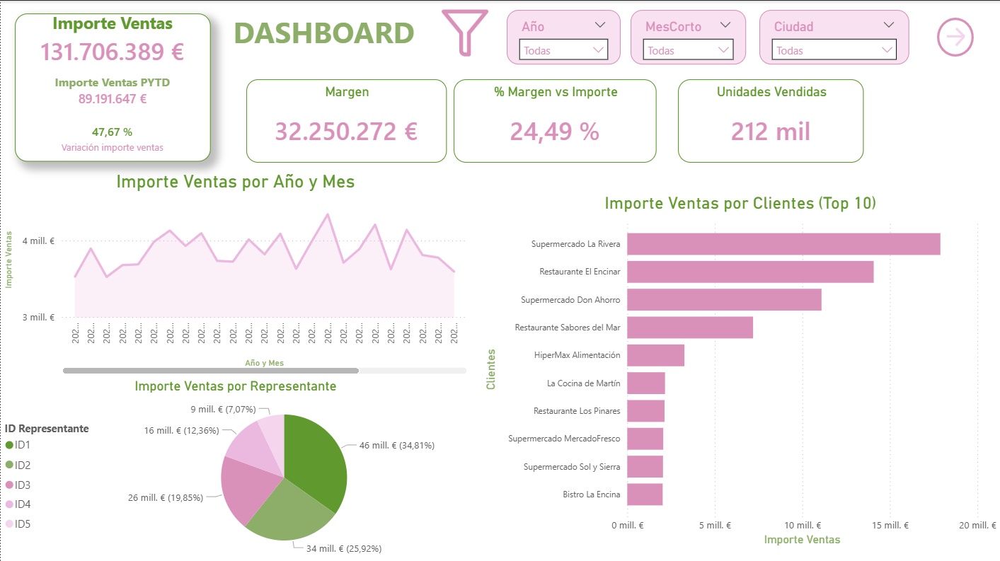
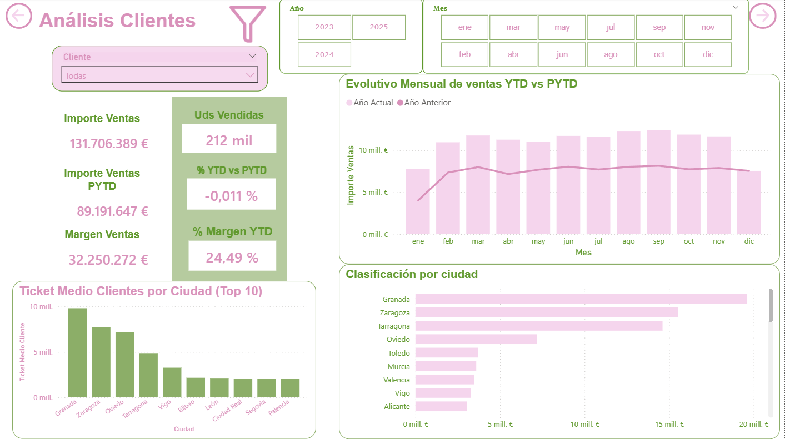
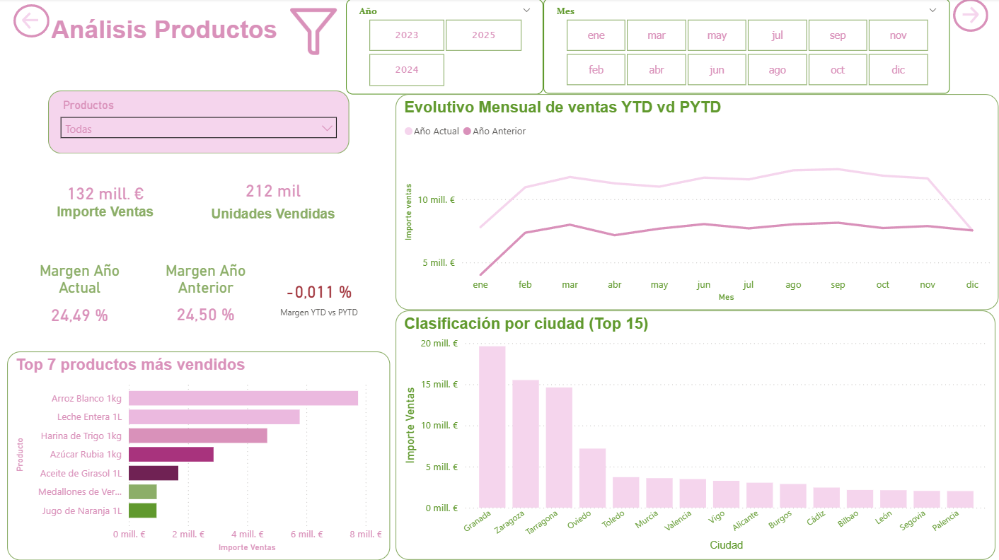
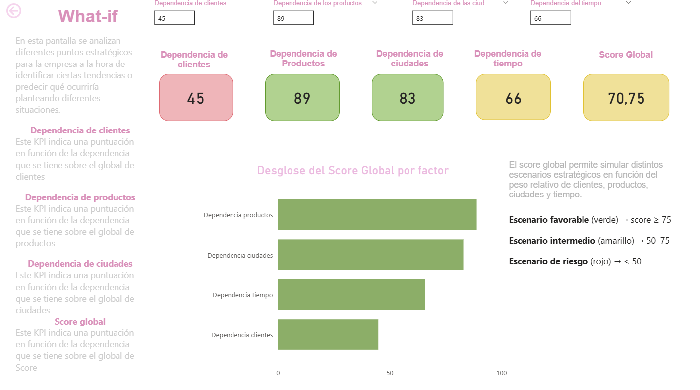

# Sales Dashboard & Business Intelligence with Power BI

Interactive Power BI dashboard developed to analyze sales performance and support business decision-making through data visualization and interactive analysis.

## 📊 Project Overview

This project consists of an interactive sales dashboard designed to provide an overview of business performance and identify relevant trends across different dimensions.

The dashboard allows users to explore sales data through interactive filters and analyze key performance indicators related to revenue, margins, units sold, customers, products, cities and time periods.

## 🎯 Objectives

- Monitor key sales and profitability indicators.
- Analyze sales evolution over time.
- Identify the highest-performing customers and products.
- Compare business performance across different cities.
- Analyze current-year performance against the previous year.
- Simulate different strategic scenarios using What-if analysis.
- Transform complex data into clear and actionable business insights.

## 📈 Dashboard Sections

### Dashboard General

Provides a high-level overview of business performance through key indicators such as:

- Total Sales
- Previous Year Sales
- Sales Margin
- Margin Percentage
- Units Sold
- Sales evolution by year and month
- Top customers by sales
- Sales distribution by representative

### Customer Analysis

Focuses on customer performance and sales evolution.

Key visualizations include:

- Monthly YTD vs PYTD sales evolution
- Average customer ticket by city
- Sales classification by city
- Interactive filtering by customer, year and month

### Product Analysis

Analyzes product performance and sales distribution.

Key visualizations include:

- Top-selling products
- Monthly sales evolution
- YTD vs PYTD comparison
- Sales classification by city
- Product-level filtering and analysis

### What-if Analysis

Includes an interactive scenario analysis designed to evaluate different strategic situations.

The model considers four factors:

- Customer dependency
- Product dependency
- City dependency
- Time dependency

These factors are combined into a **Global Score** that allows different scenarios to be classified as:

- 🟢 Favorable scenario
- 🟡 Intermediate scenario
- 🔴 Risk scenario

This functionality allows users to explore how changes in different business factors can affect the overall scenario.

## 🛠️ Tools & Technologies

- **Microsoft Power BI**
- **Power Query**
- **DAX**
- **Data Modeling**
- **Data Visualization**
- **What-if Parameters**
- **Business Intelligence**

## 📌 Key Features

- Interactive dashboards
- Dynamic filters and slicers
- KPI monitoring
- Time-based analysis
- Customer and product segmentation
- Geographical analysis
- YTD vs PYTD comparisons
- What-if scenario analysis
- Business-oriented data visualization

## 🖼️ Dashboard Preview

### General Dashboard

### Customer Analysis

### Product Analysis

### What-if Analysis

## 💡 Key Takeaway

This project combines data modeling, business intelligence and interactive visualization to transform sales data into meaningful information for business analysis and strategic decision-making.

---

**Author:** Andrea Carboneras Martínez  
**Field:** Business Analytics & Business Intelligence
